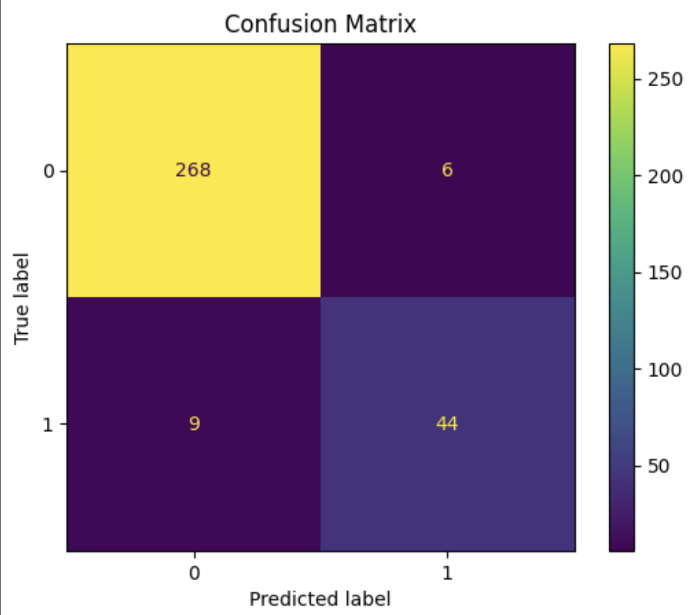

# evaluation for the model 

best model with it's scores 

{'selected_model': 'random_forest', 'test_f1': 0.8543689320388349, 'test_recall': 0.8301886792452831, 'test_roc_auc': 0.986503236468806}

confusion matrix

